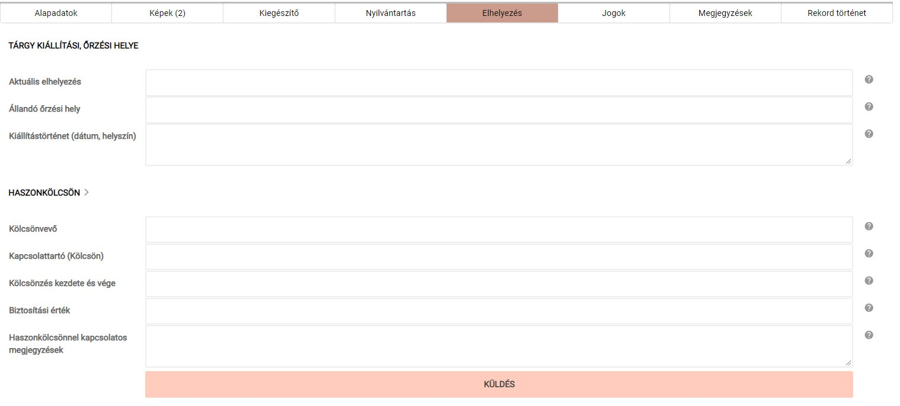

# Elhelyezés

Az „Elhelyezés" opció alatt a tárgy gyűjteményen belüli és kívüli
mozgását lekövető adatmezők találhatók.

*Az „Elhelyezés” fülön található adatmezők*

**Az itt felvett adatok a tárgy publikussá tétele esetén NEM jelennek meg a külső weboldalon.**

Az itt található adatmezők a tárgy őrzési helyét és a kölcsönzésével kapcsolatos adatok rögzítését teszik lehetővé.

Az  **Állandó őrzési hely** mezőbe a tárgy raktári helyét lehet megadni, minél pontosabb és a visszakeresés érdekében következetes helymeghatározást használva (pl. II. raktár, 15. polcsor, 10. polc, 5. doboz). Ha a tárgy aktuálisan ettől eltérő helyen (pl. kiállítás) található, akkor az **Aktuális elhelyezés** mezőt is érdemes kitölteni.

**Ezeket a mezőket a tárgy aktuális elhelyezésének lekövetése érdekében a tárgy helyének változásával egyidőben érdemes mindig frissíteni!**

A **Kiállítástörténet (dátum, helyszín)** mező az adott tárgy kiállításokon való megjelenésének kronologikus sorrendben való rögzítését teszi lehetővé, ezzel is gazdagítva a tárgy történetét.

A **Haszonkölcsönnel** kapcsolatos adatmezőket a tárgy kölcsönadásakor érdemes kitölteni. Ha a mezők ki vannak töltve, az értelemszerűen azt jelenti, hogy a tárgy éppen kölcsönözve van. Ezért a kölcsönzés lejártával az adatokat érdemes innen törölni és a tudnivalókat átvezetni a Kiállítástörténettel kapcsolatos mezőbe.

**Az adatbevitel és a későbbi módosítások itt is a „Küldés" gombra kattintva véglegesíthetők! Ennek hiányában az újonnan bevitt adatok elvesznek.**

