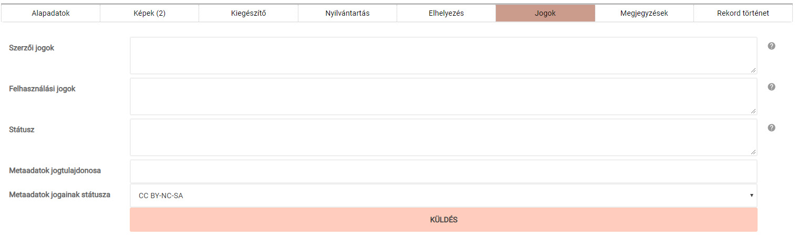

# Jogok

A szerzői és felhasználási jogokkal, illetve a tárgy státuszával kapcsolatos információk, megjegyzések felvételére használatos adatmezőket tartalmazó menüpont.

*A „Jogok” fülön található adatmezők*

**Az itt felvett adatok a tárgy publikussá tétele esetén NEM jelennek meg a külső weboldalon.**

A **Státusz** mező a szakleltárkönyvekben található azonos nevű rovatnak felel meg, azaz itt lehet rögzíteni a tárgy revíziójával, kutathatóságával és törlésével kapcsolatos adatokat, dátumozással és indoklással együtt.

**A metaadatokkal kapcsolatos jogi megkötésekre vonatkozó adatmezők** nyugat-európai szemléletet tükröznek. E szerint, ha a tárgy szaktudományos meghatározását nem a múzeum alkalmazásában dolgozó munkatárs végezte -- és szerződésben erről korábban másképp nem rendelkeztek, akkor a külső szakértőként megbízott személy jogot formálhat a tárgy meghatározásával járó szerzői jogra.

**Az adatbevitel és a későbbi módosítások itt is a „Küldés" gombra kattintva véglegesíthetők! Ennek hiányában az újonnan bevitt adatok elvesznek**
