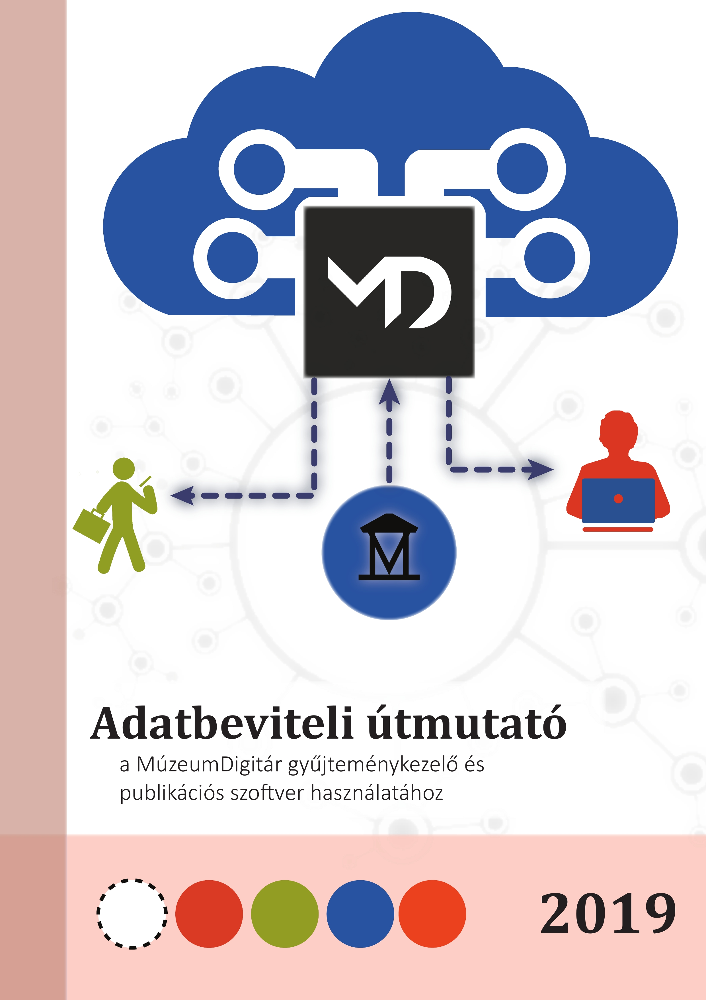

# Kezdőoldal

A MúzeumDigitár gyűjteménykezelő és publikációs rendszer egyrészt a
múzeumok, köz- és magángyűjtemények mindennapi nyilvántartási és
gyűjteménykezelési feladatait segíti, másrészt az interneten keresztül a
gyűjteményekhez való hozzáférést, a gyűjtemények közötti átjárhatóságot
biztosítja, lehetővé téve a digitalizált kulturális javak sokrétű
felhasználását mind a szakma, mind a kutatók és más érdeklődők
számára.

A MúzeumDigitár rendszerében található adatstruktúra a magyar
múzeumi szabványnak megfelelően lett kialakítva, tehát a beviteli mezők
a 20/2002. (X. 4.) NKÖM rendelet (a továbbiakban Nyilvántartási
rendelet) által előírt leltárkönyvi rovatok mindegyikét tartalmazza, a
gyűjteménykezelést elősegítő egyéb adatok felvételére is lehetőséget
biztosítva. A MúzeumDigitár rendszer tehát a jelenleg forgalomban lévő
szakleltárkönyvek elektronikus változataként fogható fel.

**A rendszerbe feltöltött képi és szöveges adatok minősége,
visszakereshetősége, szakmai hitelessége és információgazdagsága az
egyes intézmények felelőssége, ugyanakkor a résztvevő intézmények és a
külső felhasználók közös érdeke is.** Az egységes és hibátlan módon
történő adatbevitel a visszakereshetőség kritériuma, a gyűjtemények,
valamint a hazai és nemzetközi portálok (pl. europeana.eu) közötti
átjárhatóság alapfeltétele, egyben a rendszer akadálymentes és
felhasználóbarát működésének biztosítéka. **A szöveges és képi adatok
rendszerben való rögzítéséhez megfelelő felkészültség, egységes
szemléletmód, következetesség és körültekintő gondosság
szükséges.**
