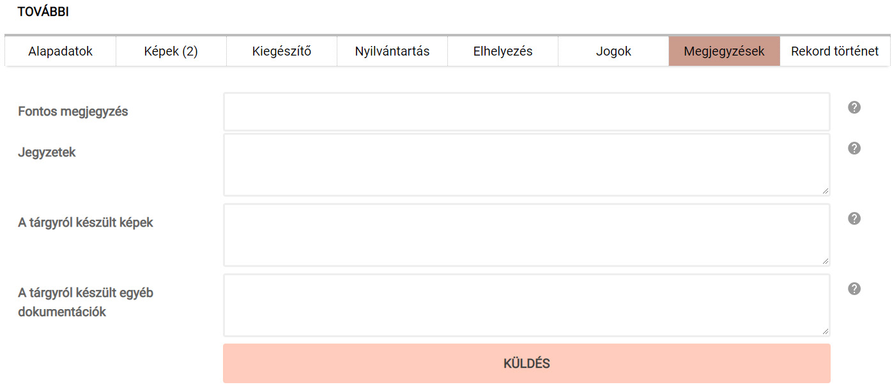

# Megjegyzések

A tárggyal kapcsolatos bármilyen további információ, megjegyzés rögzítésére alkalmas adatmezőket tartalmazó menüpont.

*A „Megjegyzések” fülön található adatmezők*

**Az itt felvett adatok a tárgy publikussá tétele esetén NEM jelennek meg a külső weboldalon.**

A **Jegyzetek** mező felel meg a leltárkönyvek Megjegyzés rovatának.

A **Tárgyról készült képek** mezőben a tárggyal kapcsolatos adattári fénykép leltári  egység számát, a  **Tárgyról készült egyéb dokumentáció** mezőben pedig az adattári dokumentum leltári egység számát van lehetőség rögzíteni.

**Az adatbevitel és a későbbi módosítások itt is a „Küldés" gombra kattintva véglegesíthetők! Ennek hiányában az újonnan bevitt adatok elvesznek.**

------------------------------------------------------------------------

Az adatbeviteli felületen szöveges és képi adatokkal feltöltött tárgyi rekordok ezt követően mentett formában rendelkezésre állnak, bármikor visszakereshetőek, újranyithatóak, szerkeszthetőek vagy listázhatóak. Az adatbázisban szereplő tárgyak webes közzétételi felületen való megjelenítése vagy elrejtése tetszőlegesen változtatható
