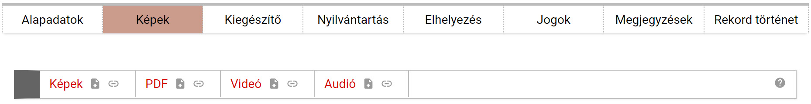

# Képek

A Képek menüpontban 4 opción keresztül (Képek, PDF, Videó, Audió) különböző ábrázolásokat/megjelenítéseket tölthet fel és kapcsolhat hozzá a tárgyakhoz. A különböző opciók mellett lévő ikonok jelentése: a zöld háromszög minden esetben az adott számítógépen található fájlok feltöltésére szolgál, a földgömbre mutató nyíl pedig webes tartalmak hozzáadását teszi lehetővé.

**Képek feltöltése
nélkül nem lehet publikussá tenni a tárgyat. Legalább egy kép feltöltése
szükséges ahhoz, hogy a weben a tárgy közzétehető legyen!**

Több feltöltött kép esetén beállítható, hogy azok milyen sorrendben
jelenjenek meg, a kép alatt található kis nyilak segítségével. A képek
sorrendje bármikor változtatható. Továbbá azt is be lehet állítani, hogy
melyik kép legyen publikus és melyik csak az adatbeviteli felületről
látható. Értelemszerűen az elsődlegesnek választott kép nem rejthető
el.

- **Kizárólag a tárgyat ábrázoló, illetve a tárgyat egyéb módon bemutató audiovizuális anyagokat töltsön fel!** Pl. a tárgy képi ábrázolásai, a tárgyról szóló leírások PDF formátumban, a tárgy működését bemutató videofelvételek, a tárgy működése közben készült hangfelvételek.

- A feltölteni kívánt audiovizuális anyagok fájlneve ne tartalmazzon ékezeteket, pontot, szóközt és különleges karaktereket!

| Megjelenítés forma | Fájlformátum | Maximális méret                                              |
|--------------------|--------------|--------------------------------------------------------------|
| Képi ábrázolás     | JPG          | 2 MB (72 dpi; min. 540, max. 2000 pixel a szélesebb oldalon) |
| Dokumentum         | PDF          | 20 MB                                                        |
| Videó              | MP4          | 20 MB                                                        |
| Audió              | MP3          | 20 MB                                                        |

2. tábla: A feltöltésre kerülő médiákkal szemben támasztott rendszerkövetelmények

- **2 MB-nál nagyobb méretű képeket NE töltsön fel a rendszerbe!** Nagyméretű képeket csak kivételes esetben, nagy részletgazdagságú tárgyak esetén érdemes a tárgyhoz csatolni. 2 MB-nál nagyobb képek tömeges feltöltése a rendszer működését akadályozza, az oldalak betöltését lassítja.

- Internetes forrás felhasználása esetén, az adott audiovizuális anyagra mutató weblink megadása előtt győződjön meg arról, hogy a weben keresztül elérhető tartalmat jogszerűen használhatja fel!
