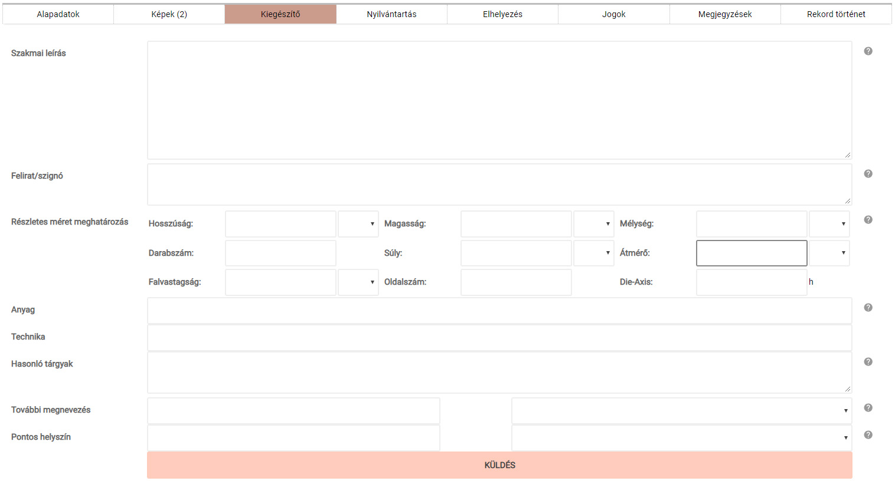
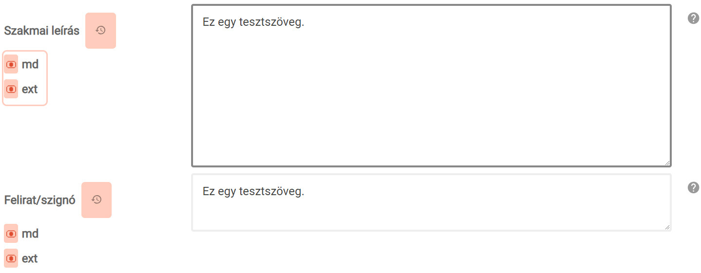

# Kiegészítő

A tárgyról tudható információk gazdagításához, az adatok részletes
visszakereséséhez a MúzeumDigitár kiegészítő adatok felvételére is
lehetőséget biztosít.

Az itt felvett adatok közül a Szakmai leírás, a Felirat/szignó, a Részletes méret meghatározás és a Hasonló tárgyak mezőkben felvett adatok tetszőlegesen publikusra állíthatók.

Ha a piros ikonra kattintunk, akkor az ikon kékre vált, jelezve, hogy az „md" opció esetén a MúzeumDigitár weboldalán, az „ext" opció esetén pedig más portálokon történő megjelenítéskor az adott mező tartalma is publikussá vált.

A **Szakmai leírás** mezőbe a nagyközönség számára kevésbé érdekes, szakmai szempontból viszont fontos információkat, pl. a tárgy fizikai jellemzőinek leírására szorítkozó leltárkönyvi bejegyzést lehet rögzíteni. Ha ez a mező kitöltésre kerül, akkor a rendszerből nyomtatott leltárkönyvbe a Szakmai leírás mező adatai kerülnek.

A **Felirat/szignó** mezőbe a tárgyon található bármilyen szignó/felirat esetén lehet rögzíteni ennek tényét. Képzőművészeti tárgyak esetén ebbe a mezőben kell rögzíteni a „Jelzet" leltárkönyvi rovatba kerülő adatot.

A Részletes méret meghatározások közül a **Darabszám** mező mindig kitöltendő, hiszen ez felel meg a leltárkönyv „Darabszám" rovatának. Kitöltésének hiányában leltárkönyv nyomtatása esetén a rovat üresen
marad!

A **További megnevezés** mező olyan tárgyak esetén kitöltendő, amelyeknek közismert megnevezése mellett más köznyelvi, tudományos vagy nyelvjárásban ismert elnevezése is ismert. A megnevezés típusa legördülő listából választható ki.

A **Pontos helyszín ** mezőben olyan helyszíneket érdemes megadni, amely szenzitív adat, és az Esemény-nél a publikusság okán nem került felvezetésre. Például pontos régészeti helyszín vagy a fotó felvételének pontos helyszíne. Házszámra pontos cím is megadható.  A helyszín típusa legördülő listából választható ki.

- **A Pontos helyszín mezőbe az adatok nem a földrajzi adatbázisból kerülnek beemelésre. Ezért az egységes és következetes adatbevitelre különösen ügyeljen!**

A Kiegészítő fülön található mezőstruktúra ezen kívül lehetővé teszi a tárgy méreteinek részletes meghatározását és az adott tárgyhoz hasonló, más gyűjteményben található tárgy adatainak felvételét is.

- Az adatok rögzítése és a későbbi módosítások itt is a „Küldés" gombra kattintva véglegesíthetők! Ennek hiányában a módosítások elvesznek.
