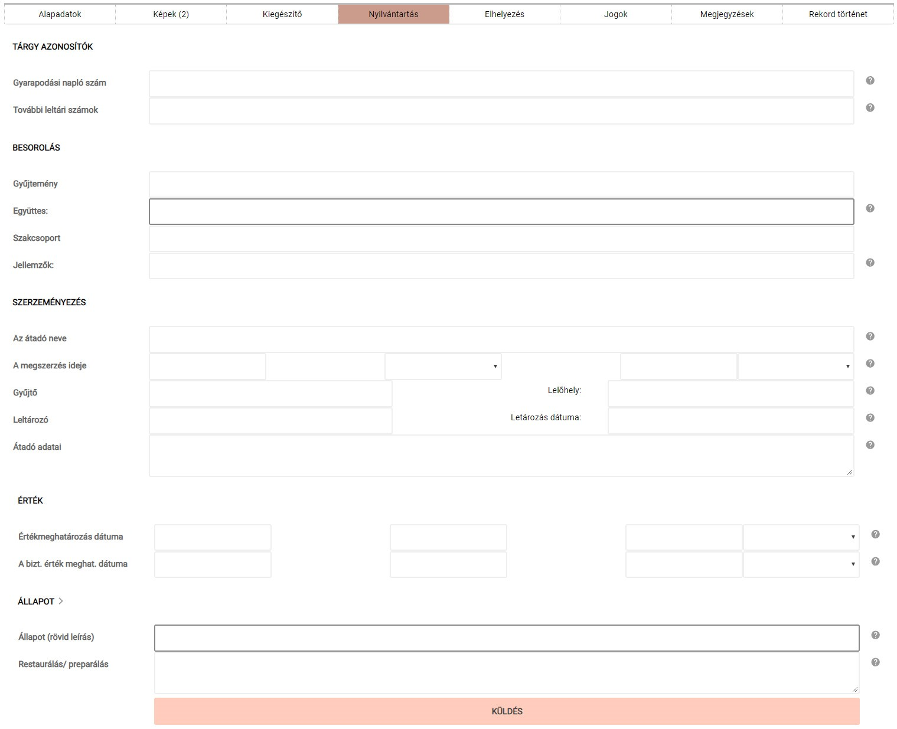

# Nyilvántartás

A „Nyilvántartás" opció alatt a szakmuzeológiai meghatározást elősegítő, leltárkönyvi rovatoknak is megfeleltetett mezőket tartalmazó beviteli felület található.

A „Nyilvántartás" fülön található adatmezők

**Az itt felvett adatok a tárgy publikussá tétele esetén NEM jelennek meg a külső weboldalon.**
