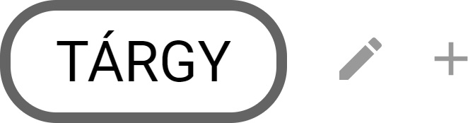
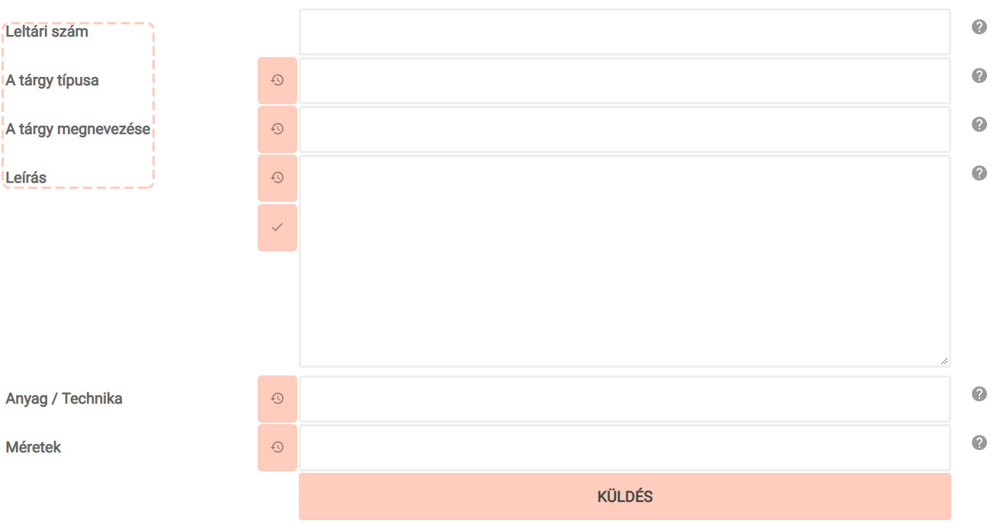
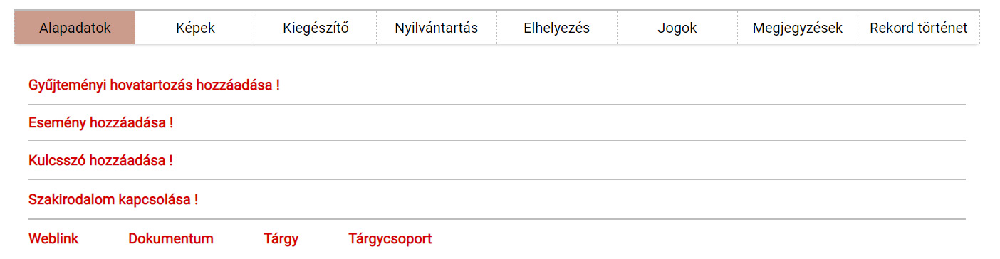

# Alapadatok

Elsőként regisztrálja a tárgyat a rendszerben az alapadatok megadásával! Ezt a Tárgy menüpont mellett levő plusz jelre (+) kattintva teheti meg:

**Az első négy adatmező** (Leltári szám, A tárgy típusa, a Tárgy megnevezése és a Leírás) **kötelezően kitöltendő! Figyelem!** Bármely adat hiánya esetén a rendszer NEM regisztrálja a tárgyat.

**A Leltári szám, A tárgy megnevezése és a Leírás mezők a *Nyilvántartási rendeletben* foglalt szabályoknak megfelelően kerülnek kitöltésre.**

**A leltári szám** tagjait elválasztó pontok után nincs szóköz! Ha a tárgynak esetleg nincsen leltári száma (Figyelem! Ez a gyakorlat szabálytalan nyilvántartást eredményez), akkor kérjük, ezt a "nincs leltári szám" kifejezéssel jelölje. Több ilyen tárgy esetén számozással különítse el a leltári szám nélküli rekordokat. Pl. nincs leltári szám\_1, nincs leltári szám\_2, stb.

⚠️ Az egy gyűjtemény -- egy leltárkönyv szabály alapján ugyanaz a leltári szám több különböző típusú szakleltárkönyvben is előfordulhat. Ezért a leltári szám előtt érdemes gyűjteményi rövidítést használni, amely következetesen minden leltári szám előtt szerepel. Pl. néprajzi tárgy esetén N, numizmatikai tárgy esetén NU. A rövidítés ne legyen hosszabb 3 betűnél, és a leltári
számtól alsó vonással legyen elválasztva Pl. NU\_2018.1.1.

⚠️ Mivel a MúzeumDigitárt több intézmény is használja, ezért a tárgyak rendszerben történő egyértelmű beazonosításához érdemes a gyűjteményi rövidítés előtt következetesen és egységesen intézményi rövidítést is használni. Az intézményi rövidítés minden esetben az intézmény nevéből legyen képezve, és 4 betűnél ne legyen hosszabb! Ezt a gyűjteményi rövidítéstől szintén egy alsóvonás válassza el. Pl. ÓM\_N\_2018.1.1., MKVM\_KT\_2018.1.1., stb.

**A tárgy típusa**  mező az Europeana-ban, illetve más nemzetközi portálokon történő publikálás miatt fontos, kitöltése kötelező. A tárgy típusa néhány fontos kivételtől eltekintve (lásd lentebb) a tárgynak megfelelő szakanyag megnevezése, amely az adott tárgy szakleltárkönyvi besorolásával azonos, azaz a Nyilvántartási rendelet 5. §-ában található felsorolásnak megfelelő szakanyag elnevezése. Ezek szerint „A tárgy típusa" lehet:

- Természettudományi
- Embertani
- Régészeti
- Régészeti állatcsont-lelet
- Iparművészeti
- Néprajzi
- Történeti
- Numizmatika
- Irodalomtörténeti
- Színháztörténeti
- Műszaki dokumentum
- Irodalmi kézirat
- Eredeti fénykép
- Adattári dokumentum
- Adattári fénykép
- Kiállítási technikai- és segédeszköz 

⚠️ **[Pontosan így, a leírt formában adja meg az adatot![ A felsorolt kategóriák közül csak EGY választható! **Kivételek:**

**Képzőművészeti szakanyag** [esetén a képzőművészeti szakleltárkönyv „Megnevezés" rovatának megfelelő adatot, tehát a műtárgy klasszifikációját kell megadni, NEM a szakanyag megnevezését! Tehát pl. festmény, szobor, dombormű, grafika, stb.

**Műszaki- és technikatörténeti tárgyi szakanyag** esetén a szakleltárkönyv „Típusnév" rovatába rögzített adatokat vigye be, ne a szakanyag megnevezését!

**A tárgy megnevezése** Ennek a mezőnek a kitöltését kérjük, **mindig nagybetűvel kezdje**! Maximális terjedelem: 100 karakter.

⚠️ Hasonló tárgyak esetén azonos megnevezést használjon! A következetes tárgymegnevezések érdekében érdemes **intézményi szinten saját tárgyszólistát** készíteni.

⚠️ Azonos megnevezéssel rendelkező tárgyak tömeges száma esetén érdemes -- a megnevezés után vesszővel elválasztva -- **az adott tárgy jellemzőivel specifikálni** a tárgyat, hogy listázás esetén könnyebben megtalálható legyen az adott tárgy.

**A  Leírás** mezőben nem a hagyományos nyilvántartásban található Leírás/használat/tartalom rovat visszakereshetőséget szolgáló, tárgyat részletesen leíró tartalmának megismétlése a cél (hiszen a tárgyhoz csatolt képen mindez látható), hanem **érdekes, a tárgy használatát és történetét bemutató információk rögzítése is szükséges**. Minden olyan adat felvehető, ami a tárgy szempontjából informatív és a felhasználók érdeklődésére számot tarthat.

⚠️ Ennél a mezőnél a rövidítések használata különösen kerülendő! Kérjük, hogy címszavak helyett **kerek mondatokban fogalmazzon!**

⚠️ Lehetőség van a „Kiegészítő" fülön található  **Szakmai leírás** mező kitöltésére is, ahova a nagyközönség számára kevésbé érdekes, szakmai szempontból viszont fontos információkat, pl. a tárgy fizikai jellemzőinek leírására szorítkozó leltárkönyvi bejegyzést lehet rögzíteni. A Szakmai leírás mező tetszőlegesen publikussá is tehető. **Ha a Szakmai leírás mező is kitöltésre kerül**, akkor a rendszerből nyomtatott leltárkönyvbe a Szakmai leírás mező adatai kerülnek átemelésre a leírásnak megfeleltetett rovatba.

Az **Anyag / Technika** mező kitöltésénél kérjük, ügyeljen arra, hogy **az azonos jellemzőket vesszővel válassza el egymástól, a két különböző kategória jellemzőit viszont perjellel különítse el**, ahogyan ennek a mezőnek az elnevezésben is látható. Pl. üveg, porcelán, réz / fújt, öntött, préselt, festett

⚠️ **Ha csak a Technika adat ismert**[, akkor az adatbevitelt perjel leütésével kezdje, mert a leltárkönyvet nyomtató modul algoritmusa így fogja felismerni, hogy a „Technika" leltárkönyvi rovatba kerülő adatról van szó. Pl. / fújt, öntött, préselt, festett. Tehát ha a Technika adatok előtt nincs perjel a mezőben, akkor nyomtatáskor az „Anyag" leltárkönyvi rovatba integrálja ezeket az adatokat is a rendszer. 
:::

**A  Méretek** megadásánál kérjük, ügyeljen a mértékegységek egységes és következetes rövidítéshasználatára! Pl. magasság: M, szélesség: Sz, hosszúság: H, átmérő: Átm, űrmérték: Űrm, ujjhossz: ujjH, stb.

**A  Küldés** gombra kattintva lesz végleges a tárgy rendszerben történő rögzítéséhez szükséges adatok mentése. Ezt követően a rendszer automatikusan generálja és megjeleníti a tárgy rendszerben regisztrált adatlapját, amin folytatható a tárgy adatainak felvétele.

⚠️ Az adatok a későbbiekben bármikor szerkeszthetők, módosíthatók. **A módosítások minden esetben a Küldés gombra kattintva véglegesíthetők!** Ennek hiányában az újonnan bevitt adatok elvesznek.

A Küldés gomb mellett megjelenő  ikonra kattintva lehetőség van az alapadatok újbóli, más nyelven történő felvételére. Ez a nemzetközi portálokon történő idegen nyelvű megjelenítés miatt lehet előnyös. Használata azonban nem kötelező.

Ezután lejjebb görgetve az oldalon, a szerkesztői sávon található **Alapadatok**  fülön különféle adatkapcsolatokat hozhat létre.

A **Gyűjteményi hovatartozás hozzáadása!**-val a tárgyat besorolhatja az adott múzeum egyik gyűjteményébe. Nagyon fontos, hogy a tárgy a múzeum megfelelő gyűjteményébe kerüljön.

⚠️ **Egy tárgyhoz csak EGY gyűjteményt vegyen fel! Ha a tárgy egy algyűjteménybe tartozik, nincs szükség a fő gyűjteménybe is besorolni a tárgyat.**

⚠️ **Ha nem kerül egy gyűjteménybe sem besorolásra az adott tárgy, elveszik a rendszerben, a teljes intézményi listában lesz csak megtalálható.**

