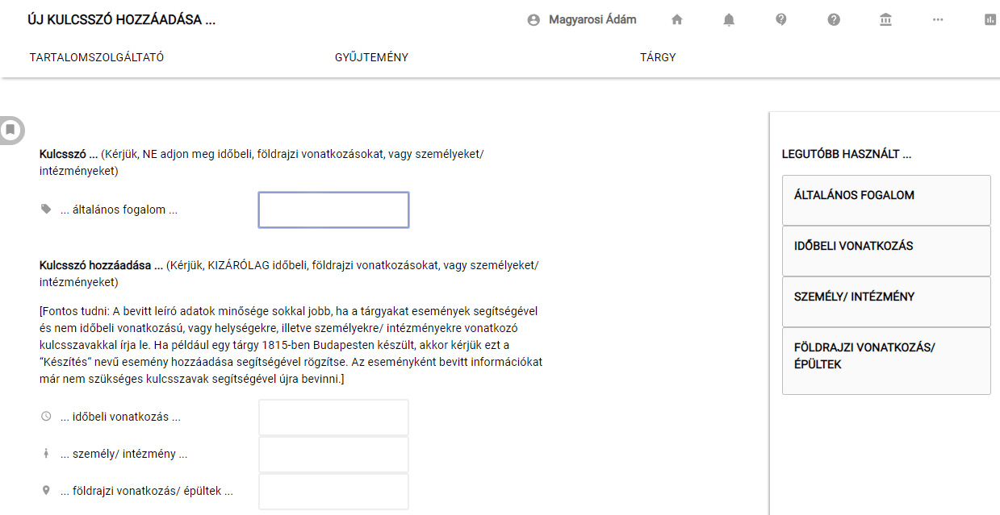
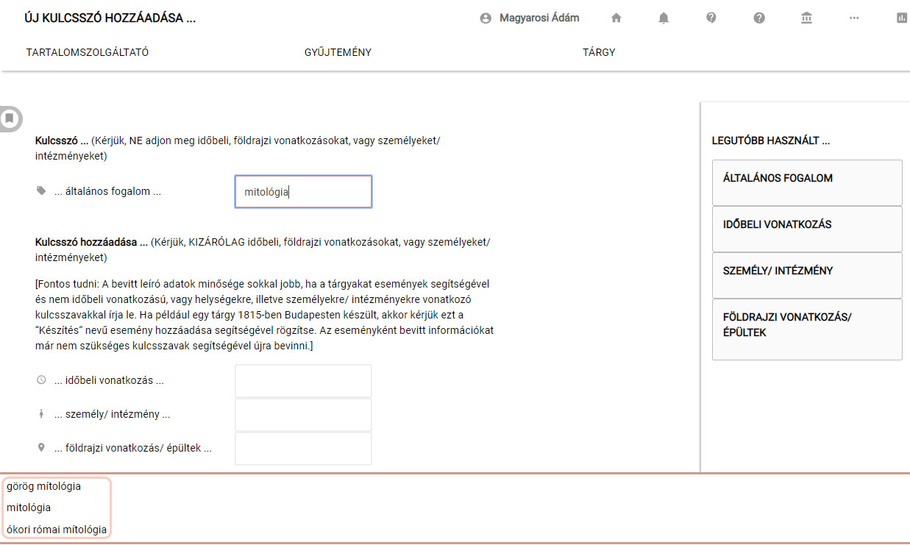

# Kulcsszó hozzáadása!

A weboldalon publikált tárgyak között kulcsszavak alapján is lehet keresni. A tárgyak ilyen módon történő rendezett/irányított visszakereshetősége érdekében az adatbevitel során a rendszerben található kulcsszó-adatbázisból lehet az adott tárgy visszakeresését elősegítő kulcsszavakat felvenni.

** Kulcsszavak felvétele esetében is egységes és következetes adatbevitelre kell törekedni!** Hasonló tárgyak esetén azonos kulcsszavakat érdemes felvenni, hiszen csak így lesz célravezető a kulcsszavakkal történő tárgyösszekötés.

Kulcsszavak felvétele az „Alapadatok" fülön a Kulcsszó hozzáadása! opcióra kattintással lehet.

Bármely kulcsszó típus esetén a rendszer a már adatbázisban lévő kulcsszavakat a begépelés folyamán automatikusan listázza, a kívánt kulcsszó a tárgyszólistáról kiválasztható.
 

- A már bevitt, listában található kulcsszavak közül válasszon! **Csak abban az esetben vegyen fel új kulcsszót, ha az a listában nem található!**
- A kulcsszavak ne komplikált összetett, ragozott szavak, jelzős szerkezetek, hanem egyszerű tárgyszavak, kifejezések legyenek! A kulcsszavakat kisbetűvel kezdve adja meg!
- Új általános kulcsszó hozzáadása esetén különösen ügyeljen a gépelési hibák elkerülésére!
  Konkrét eseményhez nem kapcsolható, tehát eseményként NEM felvett személyi/intézményi, földrajzi vagy időbeli vonatkozású kulcsszavak is hozzárendelhetőek egy tárgyhoz. Ezeknek a kulcsszavaknak a rögzítése szintén az ellenőrzött adatbázisok segítségével, az Esemény hozzáadása! fejezetrészben leírtak szerint történik.
- **Az Eseményeknél már felvett személyi/földrajzi/időbeli vonatkozású adatokat NEM kell kulcsszóként megismételni!** Azok automatikusan kulcsszavakként is funkcionálnak, ezért megismétlésük fölösleges adatduplikálást jelent.
