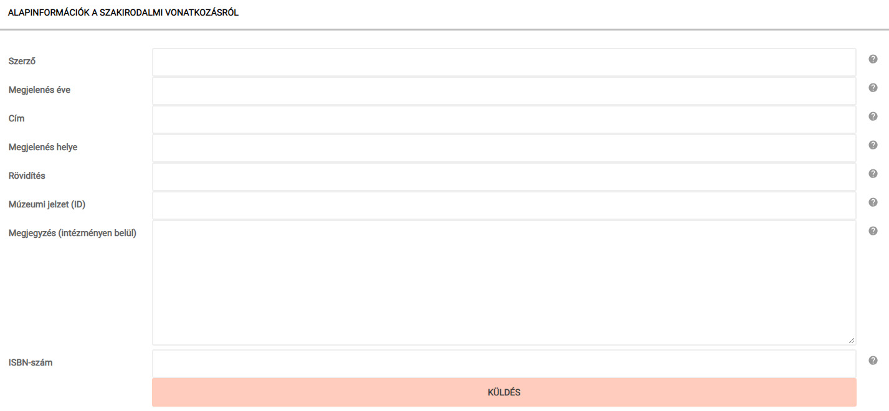

# Szakirodalom kapcsolása

A tárgyakat szakirodalmi hivatkozással is össze lehet kapcsolni. A rendszer felajánlja a már intézményi szinten felvett szakirodalmi listáról történő választást, illetve új szakirodalmi vonatkozás felvételére is lehetőséget kínál. A könyvészeti adatok rögzítésére szolgáló adatbeviteli mezők helyes kitöltését a sorok végén található információs ikonok segítik.

**Ne oldalanként, hanem kiadványonként vegye fel a szakirodalmi hivatkozást!** Oldalszám megadására a kitöltendő adatmezőknél van lehetőség.
